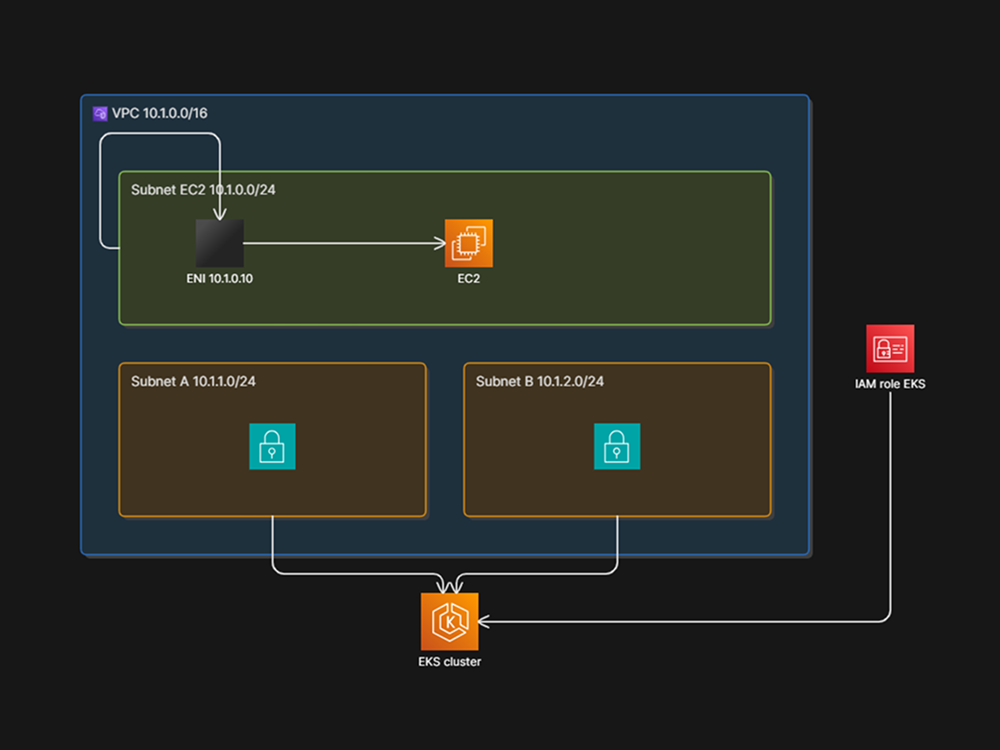

# AWS Base Infrastructure (Terraform)

Modular **Terraform** layout for core **AWS** networking.

# Design Architecture Diagram

## What this demonstrates

- **IaC** with reusable modules and remote state (S3 backend and lockfile).
- **Networking**: VPC, multi-AZ subnets, static private IP via ENI.
- **Compute**: EC2 attached to a pre-created network interface.
- **Kubernetes**: EKS cluster with a dedicated IAM role and `authentication_mode = "API"`.

## Tech stack

| Area          | Choice                                  |
| ------------- | --------------------------------------- |
| IaC           | Terraform, AWS provider                 |
| State         | S3 backend + lockfile                   |
| Region        | Configurable (default `ap-southeast-1`) |
| Orchestration | Amazon EKS                              |

## Repository layout

| Path               | Role                                                |
| ------------------ | --------------------------------------------------- |
| `main.tf`          | Root module: wires VPC, subnets, NIC, EC2, IAM, EKS |
| `variables.tf`     | Root variables (e.g. `region`)                      |
| `modules/vpc`      | VPC                                                 |
| `modules/subnet`   | Subnet (reused for EC2 and cluster AZs)             |
| `modules/nic`      | Elastic network interface                           |
| `modules/ec2`      | EC2 instance bound to ENI                           |
| `modules/iam_role` | IAM role (EKS assume role policy)                   |
| `modules/eks`      | EKS cluster resource                                |

## Prerequisites

- [Terraform](https://developer.hashicorp.com/terraform/install) **1.x** (compatible with your lockfile).
- [AWS CLI](https://docs.aws.amazon.com/cli/latest/userguide/getting-started-install.html) configured with credentials that can create the resources above.
- An **S3 bucket** (and appropriate IAM) for the backend defined in `main.tf`.

## Implementation timeline (portfolio build log)

| Date       | Delivered                                 |
| ---------- | ----------------------------------------- |
| 2026-05-05 | VPC module, subnet module                 |
| 2026-05-06 | EC2 subnet wiring, NIC module, EC2 module |
| 2026-05-12 | IAM role module, EKS module               |
| 2026-05-13 | update readme.md                          |

## Troubleshooting (local dev)

- **AWS CLI profiles** — Conflicting or stale default credentials in `%USERPROFILE%\.aws\credentials` (Windows) or `~/.aws/credentials` can make the wrong account active. Prefer named profiles and `AWS_PROFILE`, or remove overlapping `[default]` entries while testing.
- **ENI / connectivity** — If an instance or ENI behaves unexpectedly, confirm subnet routing, security groups (if added later), and that the ENI is in the intended subnet and AZ.
